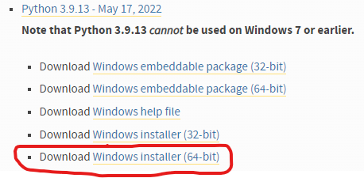

# CS1420 Python Virtual Environment Setup 2024

## Brown CS Department Machine
On Brown CS department machines, the virtual environment is already built and the packages are installed. You can directly activate it and use it after sshing into the department machines

```bash
source /course/cs1420/cs142_env/bin/activate
```

The prompt will then change to `(cs142_env) $...` to show that the virtual environment is active.

deactivate the virtual environment when you're done coding with
```bash
deactivate
```

## Personal Mac
TODO

## Personal Windows
### Check that Python 3.9 is installed by running
```
py -3.9
```
in command prompt or powershell and making sure there is no error.

If you need to install Python 3.9, go <a href="https://www.python.org/downloads/windows/">here</a> and download and run the 64-bit Windows installer for Python 3.9.13:



### Install Microsoft's Visual Studio Build Dependencies
TODO Visual studio build tools install steps here

### Create a folder for the course
How you structure your files is up to you, but we recommend making a single file directory for this course to house the Python virtual environment and all the homeworks.  This would look something like the following:
```
cs1420_code/  <--- your course directory
├── env/
├── hw1/
├── hw2/
└── ...
```
Don't worry about creating any of the subdirectories yet; we are about to create the `env/` directory and homework directories will be created as you go over the course of the class.

### Create the virtual environment
You only need to do this once during setup. Afterwards, you can directly activate the virtual environment with the step below.

To create the virtual env, navigate the the directory that contains all your CS1420 projects (`cs1420_code/` in the example file structure above), and run
```
py -3.9 -m venv env
```
to create a directory `env/` that houses our virtual environment.

### Activate the virtual environment
From your course directory, run
```
env\Scripts\activate
```
After activation, the prompt will change to `(env) $...` to show that the virtual environment is active.

While the virtual environment is active, you can call `python3.9` directly with `python` because that is the only python version that is linked in the virtual environment.

### Installing required cs1420 packages with pip
Download the `requirements.txt` from this repository and move it to you course directory.

With the virtual environment active from the previous step, use the following command to install the requried packages from pip.  This only needs to be done once during setup.
```bash
pip3 install -r requirements.txt
```
Make sure you are in your course folder where requirements.txt should be located.

### Deactivating the virtual environment
Just run
```bash
deactivate
```
from anywhere.
